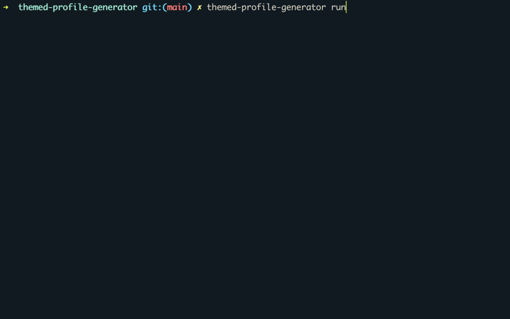
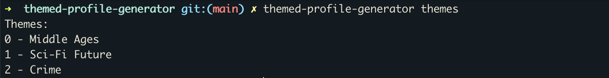

# themed-profile-generator

Hello everybody! 👐👐🏻👐🏼👐🏽👐🏾👐🏿

This is a JS package to easily generate random JSON profiles based on a theme, which can be used as Node.js module or as CLI tool.
There's a pool of themes you can choose from:

-   Middle Ages
-   Sci-Fi Future
-   Crime

## Installation

Install themed-profile-generator with npm:

```bash
  npm install -g themed-profile-generator
```

## Usage

`themedProfileGenerator(theme, numberOfProfiles)`

-   `theme` - the theme name
-   `numberOfProfiles` - the number of profiles to be generated

```js
import themedProfileGenerator from 'themed-profile-generator'

console.log(themedProfileGenerator('Middle Ages', 1))
/* [
    {
        "firstName": "Edwin",
        "lastName": "Terrowin",
        "sex": "male",
        "age": 29,
        "job": "Farmer"
    }
] */

console.log(themedProfileGenerator('Sci-Fi Future'))
/* [
    {
        "firstName": "Lane",
        ...
    },
    {
        "firstName": "Brianna",
        ...
    },
    {
        "firstName": "Alyssa",
        ...
    }
] */
```

## Command Line Usage

```
Usage: themed-profile-generator [options] [command]

Options:
  -h, --help          display help for command

Commands
  run                 Start the CLI to generate a number of random profiles of a certain theme
  generate [options]  Generate a number of random profiles of a certain theme
  themes              List all available themes
  help [command]      display help for command
```

### run

```sh
Usage: themed-profile-generator run [options]

Start the CLI to generate a number of random profiles of a certain theme
```



### generate

```sh
Usage: themed-profile-generator generate [options]

Generate a number of random profiles of a certain theme

Options:
  -t, --theme <number>     Specify the theme (default: "0")
  -p, --profiles <number>  Specify the number of profiles (default: "3")
  -h, --help               display help for command
```

Examples:

```sh
themed-profile-generator generate

themed-profile-generator generate -t 1 -p 5

themed-profile-generator generate --theme=1 --profiles=5
```

### themes

```sh
Usage: themed-profile-generator themes [options]

List all available themes
```



## Contributing

Contributions are always welcome!

See our `CONTRIBUTING.md` for ways to get started. 🚀

## Authors

-   [@KevinHarizaj](https://www.github.com/KevinHarizaj)
-   [@LenaHeiglauer](https://www.github.com/lenaheiglauer)
-   [@DanielaDottolo](https://www.github.com/dottolodaniela)
-   [@NicolasGraf](https://www.github.com/KevinHarizaj)

## Contact

If you have any feedback, please reach out to us at daniela-dottolo@gmx.at! 💌

```

```
